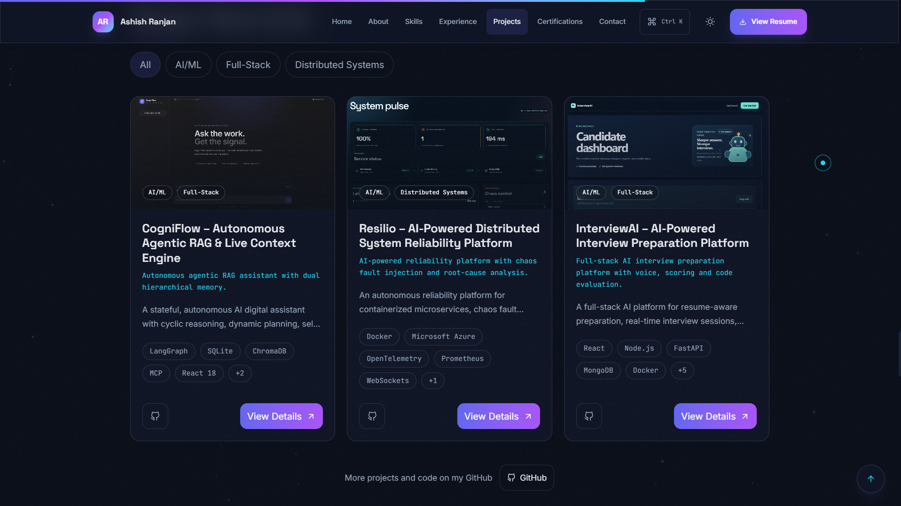
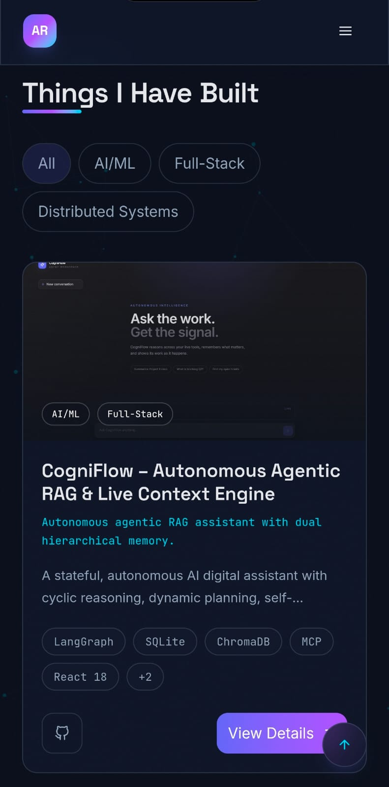
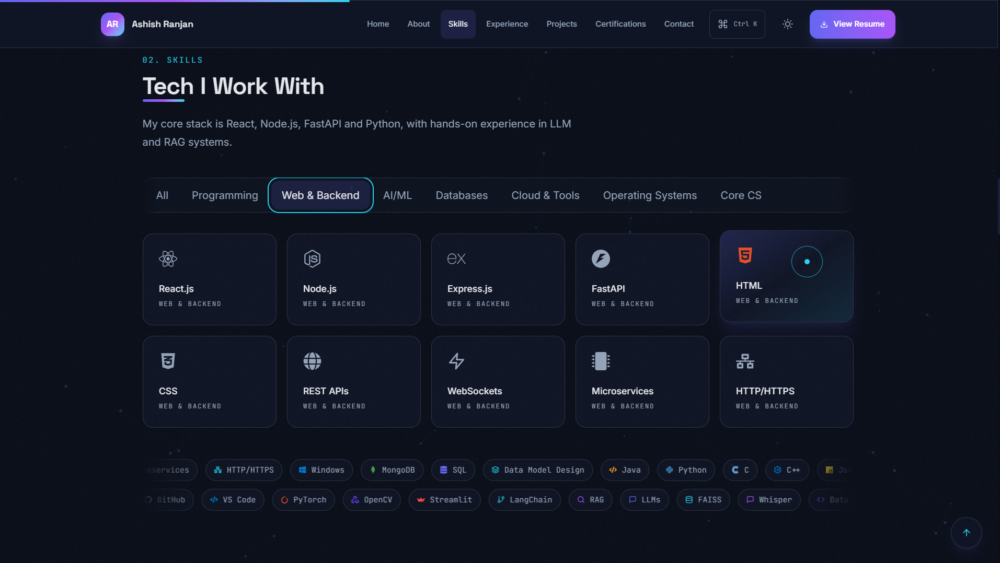
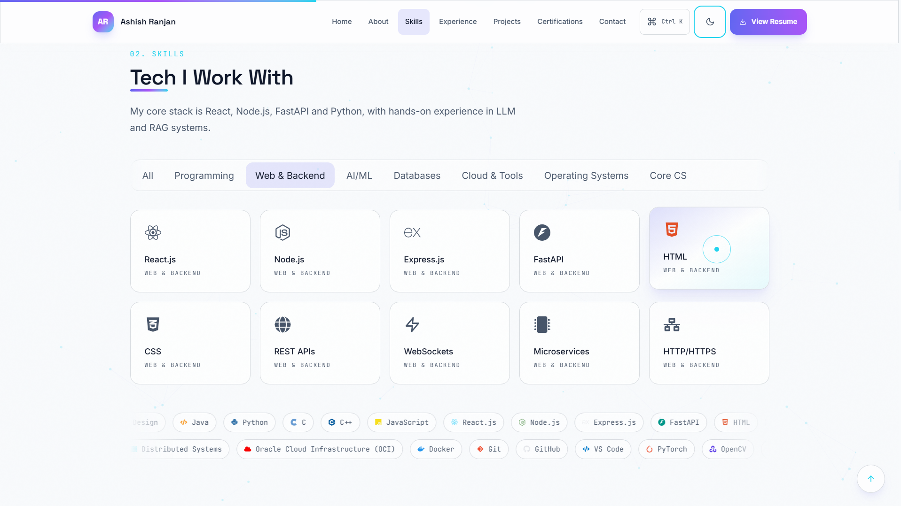

<div align="center">

# Ashish Ranjan | Developer Portfolio

**Full-stack development · Backend engineering · AI/ML applications · Biomedical AI research**

[](https://Ashish-1506.github.io/Portfolio/)
[](LICENSE)


[**View the live portfolio →**](https://Ashish-1506.github.io/Portfolio/)

</div>

---

## Table of Contents

- [About](#about)
- [Screenshots](#screenshots)
- [Key Features](#key-features)
- [Tech Stack](#tech-stack)
- [Project Structure](#project-structure)
- [Getting Started](#getting-started)
- [Editing Portfolio Content](#editing-portfolio-content)
- [Environment Variables](#environment-variables)
- [Deployment](#deployment)
- [Troubleshooting](#troubleshooting)
- [License and Contact](#license-and-contact)

## About

This is the personal portfolio of **Ashish Ranjan**, a Computer Science undergraduate (B.Tech, Cyber Physical Systems, VIT Chennai) focused on full-stack development, backend engineering, AI/ML applications, and biomedical AI research.

The site is a fast, animated, single-page application that presents my projects, research publication, experience, skills, and certifications, and gives recruiters a quick way to download my resume or get in touch.

## Screenshots

<table>
  <tr>
    <td align="center"><b>Desktop</b><br></td>
    <td align="center"><b>Mobile</b><br></td>
  </tr>
  <tr>
    <td align="center"><b>Dark theme</b><br></td>
    <td align="center"><b>Light theme</b><br></td>
  </tr>
</table>

## Key Features

- **Animated single-page experience** with smooth scroll reveals and reduced-motion support for visitors who prefer less movement.
- **Dark and light themes** with the visitor's preference saved between visits.
- **Responsive layouts** designed for mobile, tablet, and desktop.
- **Accessible by design:** semantic structure, keyboard navigation, focus management, and a keyboard-driven command palette.
- **SEO ready:** metadata, Open Graph preview artwork, sitemap, robots file, and web manifest.
- **Working contact form** powered by EmailJS, with a `mailto:` fallback when credentials are unavailable.
- **Content-driven architecture:** all text, links, and project details live in `src/data/`, so updating the portfolio never requires touching component code.
- **Automated CI/CD:** every push to `main` is built and deployed to GitHub Pages with GitHub Actions.

## Tech Stack

| Area | Technology |
| --- | --- |
| UI | React 18, JSX, Vite |
| Styling | Tailwind CSS v4 |
| Motion | Framer Motion |
| Icons | react-icons |
| Contact | @emailjs/browser |
| Fonts | Inter, Space Grotesk, JetBrains Mono |
| Quality | Oxlint, Vite production build |
| Deployment | GitHub Actions, GitHub Pages |

## Project Structure

```text
.
├── .github/
│   ├── workflows/          GitHub Pages deployment workflow
│   └── copilot-instructions.md
├── public/
│   ├── assets/             Profile, project, and website screenshots
│   └── resume.pdf          Downloadable resume
├── src/
│   ├── components/         Reusable layout, section, and UI components
│   ├── context/            Theme context and provider
│   ├── data/               Editable portfolio content
│   ├── hooks/              Shared React hooks
│   └── utils/              Link and icon helpers
├── .env.example            Template for local EmailJS credentials
├── index.html
├── vite.config.js
└── package.json
```

## Getting Started

**Requirements:** Node.js 20 or newer and npm.

```bash
# 1. Clone the repository
git clone https://github.com/Ashish-1506/Portfolio.git
cd Portfolio

# 2. Install dependencies
npm ci

# 3. Start the development server
npm run dev
```

The site opens at the local URL printed in the terminal (usually `http://localhost:5173`).

### Available scripts

| Command | Description |
| --- | --- |
| `npm run dev` | Start the development server with hot reload |
| `npm run lint` | Run Oxlint over the project |
| `npm run build` | Create an optimized production build in `dist/` |
| `npm run preview` | Serve the production build locally |

> To test the production build under the GitHub Pages sub-path, run it with the same base the workflow uses:
> `VITE_BASE=/Portfolio/ npm run build && VITE_BASE=/Portfolio/ npm run preview`

## Editing Portfolio Content

Update the modules in `src/data/` for profile details, navigation, skills, projects, experience, education, certifications, publications, and about-page content. Keep components focused on presentation and do not hardcode personal facts in them.

| To change... | Edit the data module for... |
| --- | --- |
| Name, tagline, social links, email | Profile |
| Add or edit a project | Projects |
| Add a skill or tech icon | Skills |
| Internships and research roles | Experience |
| Degrees and school records | Education |
| Certificates and verify links | Certifications |
| Research papers | Publications |

**Assets**

- Place the resume at `public/resume.pdf`.
- Public images belong in `public/assets/images/` and should be referenced with the Vite base path (`import.meta.env.BASE_URL`) so they work on GitHub Pages.
- Internship certificate links belong in the `certificates` object for the relevant entry in `src/data/experience.js`.

After editing, commit and push to `main`. The site redeploys automatically.

## Environment Variables

Copy `.env.example` to `.env` for local EmailJS testing and fill in the values from the EmailJS dashboard:

```text
VITE_EMAILJS_SERVICE_ID=
VITE_EMAILJS_TEMPLATE_ID=
VITE_EMAILJS_PUBLIC_KEY=
```

The EmailJS template should use the variables `{{from_name}}`, `{{from_email}}`, `{{subject}}`, and `{{message}}`.

> **Security:** never commit `.env` or real credentials. The same three values must be added as GitHub repository **Actions secrets** for production contact-form delivery. Without them, the form falls back to opening a prefilled `mailto:` link.

## Deployment

The workflow in `.github/workflows/deploy.yml` deploys the `main` branch to GitHub Pages. It builds with `VITE_BASE=/Portfolio/`, creates the SPA `404.html` fallback, and publishes `dist` through the official Pages actions.

**To configure a new repository:**

1. Create a public repository named `Portfolio` under `Ashish-1506`.
2. Push the `main` branch to `https://github.com/Ashish-1506/Portfolio.git`.
3. Set **Settings → Pages → Source** to **GitHub Actions**.
4. Add `VITE_EMAILJS_SERVICE_ID`, `VITE_EMAILJS_TEMPLATE_ID`, and `VITE_EMAILJS_PUBLIC_KEY` under **Settings → Secrets and variables → Actions**.
5. Open the **Actions** tab and wait for the deploy workflow to finish. The site will be live at `https://Ashish-1506.github.io/Portfolio/`.

## Troubleshooting

| Problem | Likely cause and fix |
| --- | --- |
| Blank page or missing styles after deploy | The Vite base path is wrong. Confirm the workflow builds with `VITE_BASE=/Portfolio/` and the repository is named `Portfolio`. |
| Images, resume, or favicon return 404 | A public file is referenced with an absolute `/path`. Use `import.meta.env.BASE_URL`. |
| Contact form opens an email app instead of sending | EmailJS credentials are missing. Add them to `.env` locally and to Actions secrets for production. |
| Workflow fails on `npm ci` | `package-lock.json` is out of sync. Run `npm install` locally and commit the updated lockfile. |
| Pages deploy step is skipped | Pages source is not set to **GitHub Actions** in repository settings. |

## License and Contact

The code is released under the MIT License. See [LICENSE](LICENSE).

For collaboration or professional opportunities, use the contact form on the [live portfolio](https://Ashish-1506.github.io/Portfolio/), or connect with me on [GitHub](https://github.com/Ashish-1506) and [LinkedIn](https://www.linkedin.com/in/ashish-ranjan-966986289/).

<div align="center">

Built with React, Tailwind CSS, and Framer Motion.

</div>
